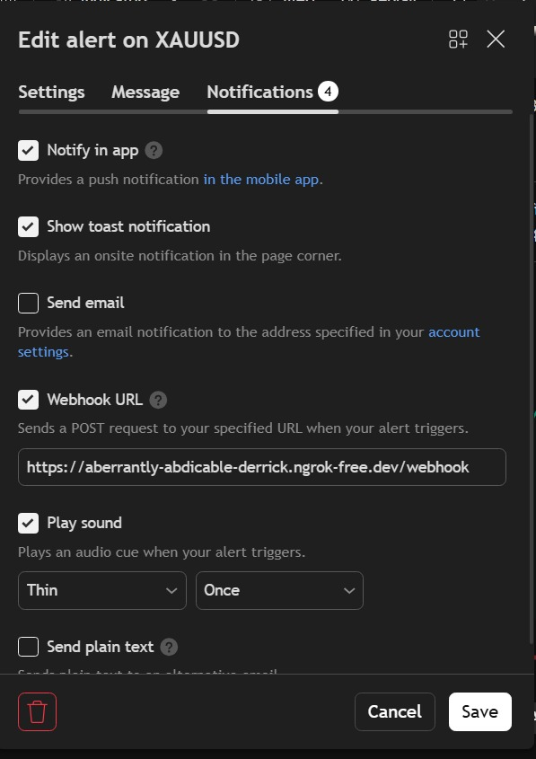
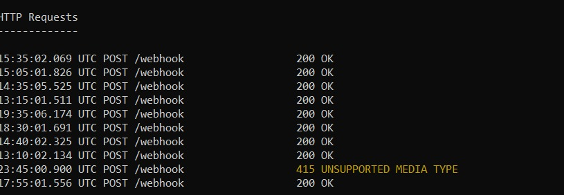
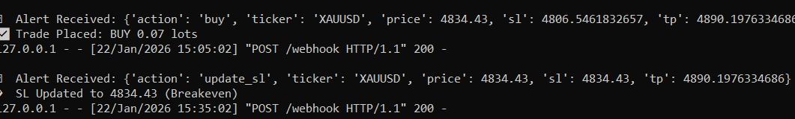

# 📈 Webhook Automation & Secure Infrastructure Framework

This repository demonstrates a professional automation pipeline designed to bridge cloud-based data alerts with local execution environments. The project focuses on real-time request handling, secure tunneling, and systems integration.

---

## 🛠️ Technical Architecture
The system is built as a three-stage pipeline to ensure low-latency data processing and network security:

* **Ingress Layer:** Utilizes **ngrok** to provide a secure, encrypted tunnel, allowing the local environment to receive data without direct exposure to the public internet.
* **Integration Layer:** Features a **TradingView** webhook configuration that dispatches real-time JSON payloads via HTTP POST requests.
* **Execution Backend:** A custom **Python** handler validates incoming data, parses the payload parameters, and manages downstream execution logic.

---

## ⚙️ System Documentation

### 📡 1. Webhook & Platform Integration
The image below shows the configuration used to bridge the external platform with the secure automation endpoint.

### 🔒 2. Secure Tunneling Session
Documentation of the active **ngrok** session, showcasing the bridge between cloud-based signals and the local backend server.

### 🖥️ 3. Real-Time Execution Log
This log captures the backend successfully processing incoming JSON signals, validating the request, and triggering the automated response logic.

---

## 📁 Repository Structure
* **Infrastructure:** Documentation of the ngrok and webhook tunneling setup.
* **Data Handling:** Python-based logic for parsing real-time JSON payloads.
* **Documentation:** Technical walkthrough of the end-to-end automation flow.

## 🔒 Security & Privacy
**Note:** Proprietary execution logic, sensitive strategy parameters, and private API authentication keys are maintained in a **Private Repository** to ensure intellectual property protection and system security. This public page serves as a technical showcase for the system's architecture and networking capabilities.

---
*Project maintained as part of a specialized focus on systems automation and cybersecurity.*
